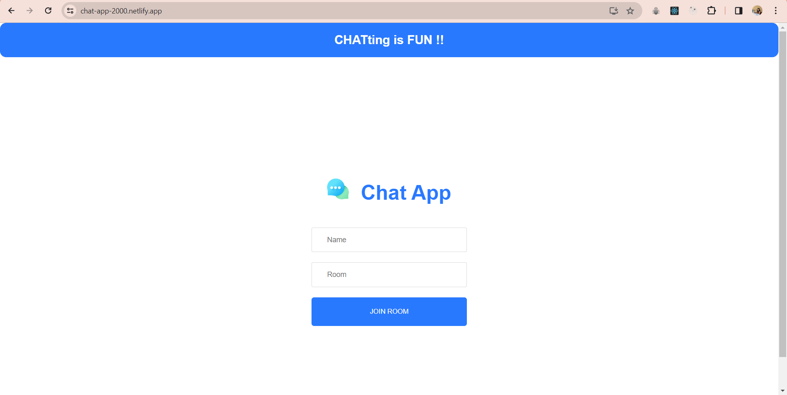
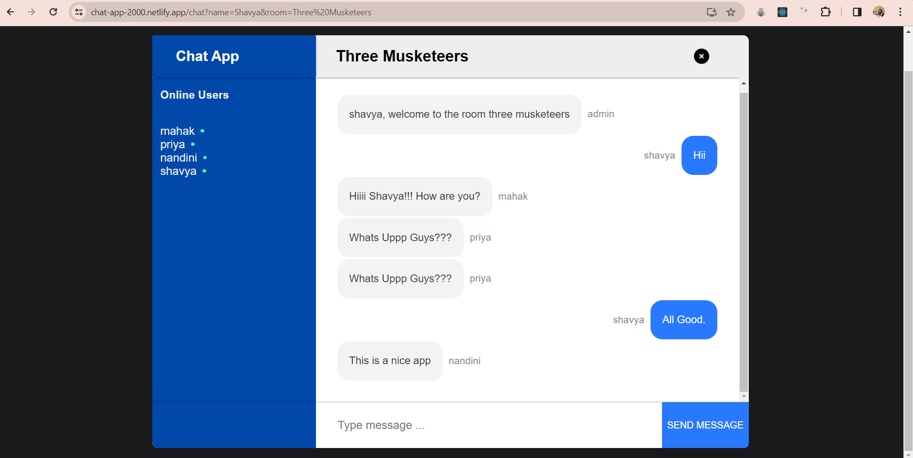

# Chat Application

Welcome to the Chat Application! This real-time chat platform allows users to join different chat rooms, interact with other users, and enjoy seamless communication.

## Deployment

The application is deployed and accessible at [https://chat-app-2000.netlify.app/](https://chat-app-2000.netlify.app/).






## Technologies Used

- **React:** The frontend of the application is built using React, a popular JavaScript library for building user interfaces.

- **Node.js:** The backend of the application is powered by Node.js, a JavaScript runtime that allows us to run server-side applications.

- **Socket.io:** Real-time bidirectional communication is achieved using Socket.io, enabling instant messaging between users.

## Getting Started

1. **Clone the Repository:**
   ```bash
   git clone https://github.com/MahakArora/ChatApplication.git
   ```
2. **Install Dependencies:**
  ```bash
   cd ChatApplication
    npm install
  ```
3.**Run the Application:**
  Start the Frontend(React)
  ```bash
  cd client
  npm start
  ```
  Start the backend(Node.js)
  ```bash
  cd serve
  npm start
  ```
4. Open in Browser
   Open your web browser and visit http://localhost:3000 to access the Chat Application locally.

  ## Contributing
If you would like to contribute to the development of this Chat Application, feel free to submit pull requests. Your contributions are highly appreciated!
